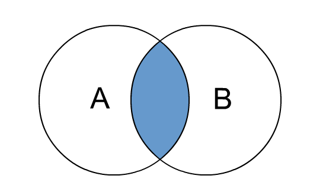

# postgresql-note

**DATA TYPE**
* BOOLEAN - to store TRUE/FALSE
* VARCHAR(n) - to store String type like name,any keyword. "n" means character length.
* INT - to store int value
* BIGSERIAL/SERIAL - to store int value incremently
* NUMERIC (3, 2) - can use 3 digit and 2 digit after decimal
* DATE -  stores the dates only
* TIME - stores the time of day values
* TIMESTAMP - stores both date and time values

**Two most useable command**

* \l - to see the list of all database
* \q - quit

**To Create database**
      
      CREATE DATABASE databasename;

**To connect with database**

* \c databasename

**To delete/drop a database**

      DROP DATABASE databasename;

**TO CREATE table**
      
      CREATE TABLE person(
      id INT NOT NULL PRIMARY KEY,
      first_name VARCHAR(20) NOT NULL,
      last_name VARCHAR(20) NOT NULL,
      gender VARCHAR(7) NOT NULL,
      join_date DATE NOT NULL,
      email VARCHAR(20)
      ):
  
  * id =variable
  * INT = data type
  * NOT NULL = id can't be null
  * PRIMARY_KEY = unique identifier (every primary key is unique)
 
 **To see Table list**
 * \d
 
 **To make auto-increment**
 
      CREATE TABLE person(
           id BIGSERIAL NOT NULL;
           .
           .
      ):
 
 **To see all table list**
 
 * \d
 
 **To see individual table structure**
 
 * \d tablename
 
 **TO delete/drop table**
            
       DROP TABLE author;
 
 **To insert data into a table**
 
       INSERT INTO person( 
       id,first_name,last_name,gender,join_date,email
       )
       VALUES(
       1,'Chandler','Bing','MALE',DATE '2021-02-02', 'chandler@gmail.com'
       );
       
 * **INSERT INTO person()** into this bracket we can specify what we will input
 * To insert DATE type values have to specify **DATE** before writting date,
 
 # SELECT KEYWORD
 
 **To see everything from our Table**
 
    SELECT * FROM person;
   
**To see individual column**

    SELECT first_name FROM person;

**To see multiple column**
  
     SELECT first_name,last_name FROM person;

**Sorting data**

     SELECT * FROM person ORDER BY first_name ASC/DESC;

**To get unique value**
  
    SELECT DISTINCT join_date FROM person;
    
**To filter data based on condition**

    SELECT * FROM person
    WHERE first_name='Chandler';
    
* It will give us everything from person if first_name is Chandler

**To filter data based on multiple condition**

    SELECT * FROM person 
    WHERE first_name='Chandler' AND last_name='Bing';
    
* There are two condition base keyword AND & OR..
* AND = have to match both side.
* OR = have to match any of the side not both.
    
**Comparison operator**

* <	less than
* \>	greater than
* <=	less than or equal to
* \>=	greater than or equal to
* =	equal
* <> or !=	not equal

**Arithmatic operation**

    SELECT 1=1; -> output TRUE
    SELECT 1<>1; -> output FALSE
    SELECT 10+2; -> 12
    SELECT 10^3; -> 100
    
    SELECT price*10 FROM person;
    SELECT * FROM person WHERE id>5;
    
**TO filter a null value**

    SELECT * FROM person WHERE email IS NULL;
    
**To print a limited data**

    SELECT * FROM person
    LIMIT 2;

* Only first two row will be printed

**TO start from any row**

    SELECT * FROM person 
    OFFSET 5;
    
* It will print row from 5 number row.

**IN keyword**

    SELECT * FROM person 
    WHERE id in (2,3);
   
 * if any person's id = 2 or 3, his data will be printed

**To select a range of data from a table**
  
    SELECT * FROM person 
    WHERE join_date 
    BETWEEN '2019-02-02' AND '2021-03-02'

**Wild Card / Regular expression**

* % = any number of character
* _ = only one number of character

      SELECT * FROM person 
      WHERE email LIKE '%@gmail.com';
      
 * % = any number of character.
 * LIKE = equal. (work same way)
 * it will be matched by every person who has an email
 * because every email has some character before @.

        SELECT * FROM person 
        WHERE gender LIKE '__LE';
        
 * _ = only one character
 * there are two _ (unserscore) that 
 * means Before 'LE' there must be two character 
 * otherwise it won't print table's data
    
        SELECT * FROM person 
        WHERE gender ILIKE '__LE';
 
 * ILIKE means ignore case (that means either we put small letter or capital letter it will behave same)

**Aggregate Functions**

* AVG() – return the average value.
* COUNT() – return the number of values.
* MAX() – return the maximum value.
* MIN() – return the minimum value.
* SUM() – return the sum of all or distinct values.
* ROUND() - return the round value

     * print average mark
      
      SELECT AVG(mark)
      FROM student;
      
     * print how many student inserted in database

      SELECT COUNT(*)
      FROM student;

     * print max mark from all student

      SELECT MAX(mark)
      FROM student;

     * print min mark from all student

      SELECT MIN(mark)
      FROM student;
 
     * print total sum of all student mark

      SELECT SUM(mark)
      FROM student;

 

**GROUP BY**

**HAVING keyword**

      SELECT country_of_birth, COUNT(*)
      FROM person 
      GROUP BY country_of_birth
      HAVING COUNT(*)>5;

* In aggregate function we can't use **WHERE** keyword 
* That's why we use **HAVING** instead of **WHERE** 
* but they work same.

**To override a column name**

      SELECT first_name AS surname FROM person;
      
**If we won't found any value we will use COALESCE to set our own value as a show piece**

      SELECT COALESCE(email, 'email is not found') AS email FROM person;
      
**CONCATENATE**

      SELECT first_name||' '||last_name
      AS "name_of_people"
      FROM person;

**Time Stamp**

      SELECT NOW();
      
* print current date,time

**Filter time stamp**

      SELECT NOW()::DATE;
      
* print current date

**subtracting date(can use MONTHS)**
      
      SELECT NOW() - INERVAL '1 YEAR';

**To extract individual data from time stamp**

      SELECT EXTRACT(MONTH FROM NOW());
            
* print number for month example (2 for february)

**To get age**

      SELECT first_name,last_name,
      AGE(NOW(),date_of_birth) AS age
      FROM person;
      
# DELETE KEYWORD

**To delete all the data from a table**

      DELETE FROM person;

**To delete with where**

      DELETE FROM person WHERE id=1;
      
* we can use eveything, which we used with **SELECT** keyword.

# UPDATE KEYWORD

**Update column**
      
      UPDATE person SET email='schafer@gmail.com'
      WHERE id = 2;
      
**To update multiple column at one time**

      UPDATE person SET first_name='Itachi',
      last_name='Uchiha' 
      WHERE id = 3;

# UNIQUE  

**Adding primary key**

            CREATE TABLE person(
                  id INT PRIMARY KEY,
                  .
                  .
            ):
      
  * To add multiple primary key we will use this way(2nd one):
       
            CREATE TABLE person(
                  id1 ....,
                  id2 ....,
                  PRIMARY KEY (id1, id2)
            ):
      
       * Suppose id1 is not unique nor id2
       * but if we add both of them it makes an 
       * unique id which we called **COMPOSITE KEY**
       * instead of **PRIMARY KEY**

**UNIQUE constraint**

            CREATE TABLE person(
                  email VARCHAR(50) UNIQUE,
                  .
                  .
            ):
            
  * To add multiple column as unique
  
            CREATE TABLE person(
                  .
                  .
                  UNIQUE(name,email)
            ):
       
# ALTER keyword

**To add column in an existing table**

      ALTER TABLE person 
      ADD COLUMN roll INT NOT NULL;

**To drop column**

      ALTER TABLE person DROP
      COLUMN roll;
     
**To rename column**

      ALTER TABLE person RENAME
      COLUMN roll TO student_roll;

**To rename a table**

      ALTER TABLE person
      RENAME TO new_person;
      
**Set primary key with ALTER**

      ALTER TABLE person
      ADD PRIMARY KEY(id);

# Handle Error

**Deal with duplicate key error / exception**

* If we insert a value with duplicate primary key or unique value compiler will give us an error.
* To solve this:

      INSERT INTO person(id,name) 
      VALUES(201,'Luffy')
      ON CONFLICT(id) DO NOTHING:
      
     * id have to be unique
     * Now if we add multiple primary key or unique value 
     * it won't gives us an error.

**Update value with duplicate**

      INSERT INTO person(id,name,email)
      VALUES(201,'Sheldon','sheldon@gmail.com')
      ON CONFLICT (id)
      DO UPDATE SET email=EXCLUDED.email;
      
 * This time instead of **DO NOTHING** 
 * it will update our email.
 * If we insert a value with same id and different 
 * email , email will be updated.
 * we can set multiple value to update this way.

**FOREIGN key**

* When we use any table's primary key to another table it's called foreign key 

            CREATE TABLE car(
                 id BIGSERIAL NOT NULL PRIMARY KEY,
                 .
                 .
            ):
            
            CREATE TABLE person(
                  .
                  .
                  car_id INT REFERENCES car(id)
            ):
            
     * In car table id is a primary key
     * we use car's id (which is a primary key) in person
     * table as a foreign key. 
     * Before creating person, we have to create car table to use
     * car's id as a foreing key
     * and also have to insert value first in car's table
  
# RELATIONSHIP
  
**One To One relationship**
      
            CREATE TABLE car(
                 id BIGSERIAL NOT NULL PRIMARY KEY,
                 .
                 .
            ):
            
            CREATE TABLE person(
                  .
                  .
                  car_id INT REFERENCES car(id),
                  UNIQUE (car_id)
            ):

* We set car_id **UNIQUE** ,so that one user can have only one car
* and one car can be purchased by only one person **(ONE TO ONE)**
* If we won't use unique it would be **ONE TO MANY Relationship**
* because any person can purchase multiple car.

# JOIN KEYWORD

**INNER JOIN**

      SELECT * FROM person
      JOIN car ON person.car_id=car.id;
      
 * Basically **JOIN** help us to link person and car table. 
 * If person's **car_id** and car's **id**'s are same/equal 
 * then it will print those row's.

            SELECT person.first_name,car.model,car.price
            FROM person
            JOIN car ON person.car_id=car.id;
     * print first name from person
     * print model from car
     * print price from car

**LEFT JOIN**

            
 * **LEFT JOIN** print all left table property
 * **person JOIN car**
 * print person's all property
 * but only print car's property which are same.

            SELECT * FROM person
            LEFT JOIN car ON person.car_id=car.id;
 
      * It will print person table's all row not car table's row

**RIGHT JOIN**

* As same as left join 

**Deleting records with foreign key**

   * We can't delete a key of a table
   * when another table is using that key as a foreign key 
   * So, to delete a foreign key related table 
   * we have to set null or delete that row 
   * which is using that key as a foreign key.

